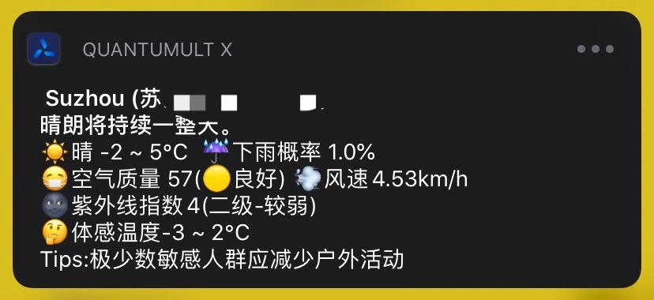

# TaskConfig
> QuantumultX专用的任务执行，作者没有Surge因此无法进行适配，请谅解…

`文中所有获取Cookie的脚本都无需禁用，仅会在cookie变化的时候触发`

`文中所有获取Cookie的脚本都无需禁用，仅会在cookie变化的时候触发`

`文中所有获取Cookie的脚本都无需禁用，仅会在cookie变化的时候触发`

## 签到

### 百度贴吧

> 此功能来源于此git
> 
> 如有引用或基于此版本的修改请注明即可


#### 获取Cookie

```quanx_config
[rewrite_local]
# 如果您有百度贴吧APP，则可以使用此项配置，点击"我的"即可
#【需配置hostname = c.tieba.baidu.com】
;https?:\/\/c\.tieba\.baidu\.com\/c\/s\/login url script-response-body cookie/cookie_baidu_tieba_app.js

# 如果您不想使用APP,则可以直接网页浏览https://tieba.baidu.com ,弹出获取提示即可
#【需配置hostname = tieba.baidu.com】
;^https?:\/\/tieba.baidu\.com url script-response-body cookie/cookie_baidu_tieba_h5.js

[mitm]
#贴吧APP专用
hostname = c.tieba.baidu.com
#网页贴吧专用
hostname = tieba.baidu.com
```

#### Task

```quanx_config
[task_local]
# 表示每天07:32分执行一次
32 7 * * * task/sign_baidu_tieba_v2.js
```

#### 配置项

脚本有默认的配置，可以不用理会配置项，如果您想自定义，可以查看

```javascript
/*
脚本执行模式（默认值0）
 0 自动切换(30个以上贴吧,执行并行签到;30个一下执行串行签到)
 1 串行签到(签到速度快，但是贴吧过多的时候会导致qx崩溃)
 2 并行签到（签到速度稍慢，但可以全部执行签到且不会导致qx崩溃）
*/
var useParallel = 0;

/*
单次处理数量(默认值20)
由于系统通知可查看的消息行数有限,超过20行以后的数据不会在消息中显示
所以如果您想查看到每一个签到的具体情况,直接使用默认值20即可
如果你只想一次通知直接签到完毕,直接将此值修改为999即可
*/
var singleNotifyCount = 20; //想签到几个汇总到一个通知里,这里就填几个(比如我有13个要签到的,这里填了5,就会分三次消息通知过去)
```

#### 错误处理

目前常见的报错主要是`need vcode `

此错误表示需要输入验证码，非签到脚本的问题

这个需要您手动前去验证或者退出登录重新获取新的cookie试试

### 网易云音乐

> 此代码源于https://github.com/chavyleung/scripts
>
> 并进行提示和内部逻辑的优化
>
> 感谢[@chavyleung](https://github.com/chavyleung)


#### 获取Cookie

```quanx_config
[rewrite_local]
# 此处用于网易云音乐cookie获取，当失效时需浏览器访问并登录:https://music.163.com/m/login 获取cookie
^https?:\/\/music\.163\.com url script-response-body cookie/cookie_netease_music.js

[mitm]
hostname = music.163.com
```

#### Task

```quanx_config
[task_local]
# 表示每天07:33分执行一次
33 7 * * * task/sign_netease_music.js
```

### 爱奇艺会员

> 此代码源于 https://github.com/NobyDa/Script
>
> 仅拷贝过来
>
> 感谢[@NobyDa](https://github.com/NobyDa)


#### 获取Cookie

```quanx_config
[rewrite_local]
# 此处用于爱奇艺cookie获取，加mitm后打开APP，点击“我的”即可
https:\/\/passport\.iqiyi\.com\/apis\/user\/info\.action.*authcookie url script-response-body js/cookie/cookie_iqiyi.js

[mitm]
hostname = passport.iqiyi.com
```

#### Task

```quanx_config
[task_local]
# 表示每天07:34分执行一次
34 7 * * * js/task/sign_iqiyi_bonus.js
```

### 京东

> 此代码源于 https://github.com/NobyDa/Script
>
> 仅拷贝过来
>
> 感谢[@NobyDa](https://github.com/NobyDa)


#### 获取Cookie

```quanx_config
[rewrite_local]
# 此处用于京东cookie获取，当失效时需要手动登录京东网页版https://bean.m.jd.com/签到获取Cookie, 待QX弹出获取成功通知即可
;https:\/\/api\.m\.jd\.com\/client\.action.*functionId=signBeanIndex url script-response-body cookie/cookie_jd_bonus.js

[mitm]
hostname = api.m.jd.com
```

#### Task

```quanx_config
[task_local]
# 表示每天07:31分执行一次
31 7 * * * task/sign_jd_bonus.js
```

### V2EX

> 此代码源于https://github.com/chavyleung/scripts
>
> 并对cookie的获取进行优化,使得cookie可以得到及时的更新
>
> 感谢[@chavyleung](https://github.com/chavyleung)


#### 获取Cookie

```quanx_config
[rewrite_local]
# 此处用于V2EX cookie获取，浏览器打开https://www.v2ex.com/mission/daily 后提示成功即可
^https:\/\/www\.v2ex\.com\/mission\/daily url script-response-body cookie/cookie_v2ex.js

[mitm]
hostname = *.v2ex.com
```

#### Task

```quanx_config
[task_local]
# 表示每天07:31分执行一次
31 7 * * * task/sign_v2ex.js
```

## 功能

### 天气

> 此功能来源于此git
>
> 如有引用或基于此版本的修改请注明即可



#### API KEY申请

使用此脚本需要申请key

- [Dark Sky API](https://darksky.net/dev)
- [Aqicn API](http://aqicn.org/data-platform/token/#/)

#### 配置项

js文件一打开最前面就是这个配置

申请一下两个api的key,再用谷歌地图获取一下你想获取位置的经纬度填入即可

最后三个选项用于精简显示数据,默认都是显示的

```javascript
let config = {
    darksky_api: `填这里不要填错了`, //从https://darksky.net/dev/ 上申请key填入即可
    aqicn_api: `填这里不要填错了`, //从http://aqicn.org/data-platform/token/#/ 上申请key填入即可
    lat_lon: "填这里", //请填写经纬度,直接从谷歌地图中获取即可，用英文逗号(,)隔开经纬度，记住经纬度中间不要有空格。例如"31.3116247,120.5944135"
    lang: 'zh', //语言,请不要修改
    uv: true, //紫外线显示,false则不显示
    apparent: true, //体感温度显示,false则不显示
    tips: true //空气质量建议显示,false则不显示
}
```

#### Task

```quanx_config
30 7 * * * task/weather_dark.js
```

